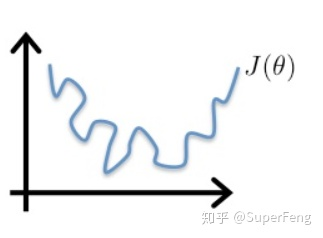

# Logistic Regression

## Binary Classification

 Given an , we want to predict the probability $$\hat{y}=P(y=1 | x)$$ where $$x\in R^{n_x}$$

## Logistic Regression

Logistic Regression tries to approximate the above probability using the following mathematic model:

$$
\begin{split} \hat{y} &= P(y=1|X, w, b) \\ &= \sigma(w^Tx+b) \end{split}
$$

where $$w \in R^{n_x}$$, and $$b\in R$$.

## Loss Function

Given a training set $${(x^{(1)}, y^{(1)}), (x^{(2)}, y^{(2)}), ..., (x^{(m)}, y^{(m)})}$$, we want $$\hat{y}^{(i)} \approx y^{(i)} $$. For logistic regression, a simple mean-squared error won't help the gradient descent work well. Because if we use the min-squared error, the curve of the loss function will be like this:

which is not convex. Instead we use a loss fun: 

$$
\mathcal{L}(\hat{y},y)=-\left(ylog\hat{y}+(1-y)log(1-\hat{y})\right)
$$

## Cost Function

The cost function is the average loss for the whole training set: $$\begin{split}\mathcal{J}(w, b)&=\frac{1}{m}\sum_{i=1}^m \mathcal{L}(\hat{y}^{(i)},y^{(i)})\\ &=-\frac{1}{m}\sum_{i=1}^m \left[y^{(i)}log\hat{y}^{(i)}+(1-y)log(1-\hat{y}^{(i)})\right] \end{split}$$

## Gradient Descent for Logistic Regression

The cost function $$\mathcal{J}(w,b)$$is convex, so we can get its global minimum using gradient descent regardless the initial values for $w$ and $b$. we update $w$ and $b$ repeatedly:

$$
w:=w-\alpha\frac{d\mathcal{J}}{dw}
$$

$$
b:=b-\alpha\frac{d\mathcal{J}}{db}
$$

   where $$\alpha$$ is the learning rate.

