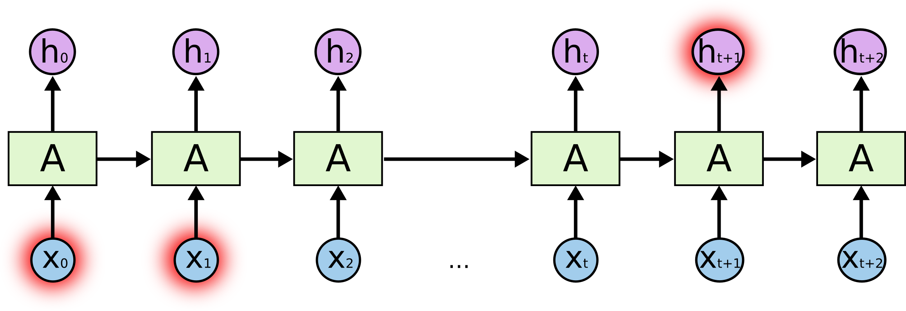

# RNN

## Structure

If we unroll the RNN, we will find that RNN is nothing different from a normal neural network.

## The Problem of Long-Term Dependencies

Sometimes, we only need to look at recent information to perform the present task. For example, consider a language model trying to predict the next word based on the previous ones. If we are trying to predict the last word in “the clouds are in the _sky_,” we don’t need any further context – it’s pretty obvious the next word is going to be sky. In such cases, where the gap between the relevant information and the place that it’s needed is small, RNNs can learn to use the past information.

But there are also cases where we need more context. Consider trying to predict the last word in the text “I grew up in France… I speak fluent _French_.” Recent information suggests that the next word is probably the name of a language, but if we want to narrow down which language, we need the context of France, from further back. It’s entirely possible for the gap between the relevant information and the point where it is needed to become very large.

Unfortunately, as that gap grows, RNNs become unable to learn to connect the information.

In theory, RNNs are absolutely capable of handling such “long-term dependencies.” A human could carefully pick parameters for them to solve toy problems of this form. Sadly, in practice, RNNs don’t seem to be able to learn them. The problem was explored in depth by [Hochreiter \(1991\) \[German\]](http://people.idsia.ch/~juergen/SeppHochreiter1991ThesisAdvisorSchmidhuber.pdf) and [Bengio, et al. \(1994\)](http://www-dsi.ing.unifi.it/~paolo/ps/tnn-94-gradient.pdf), who found some pretty fundamental reasons why it might be difficult.

