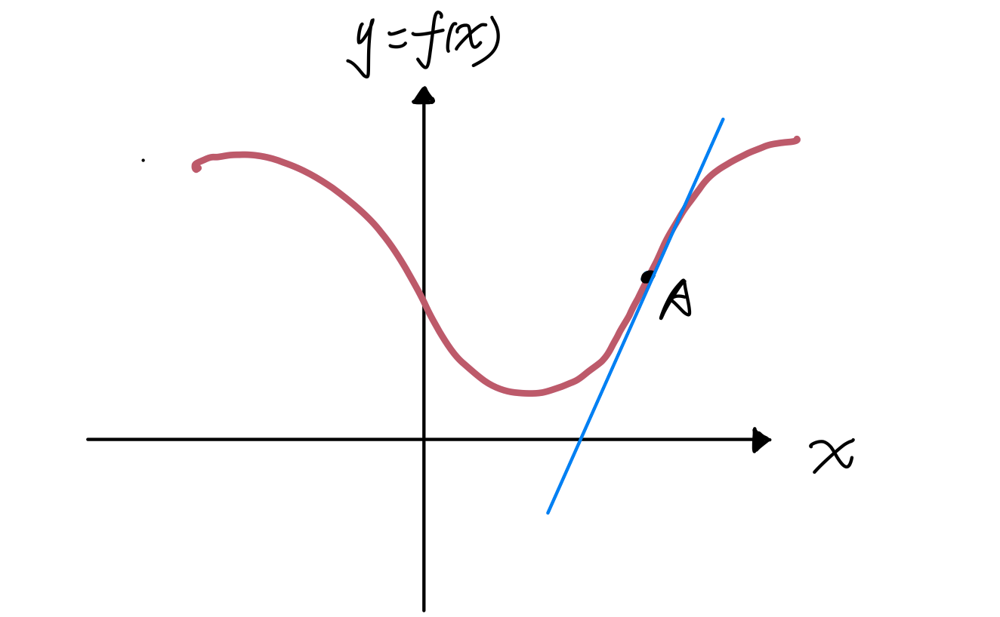
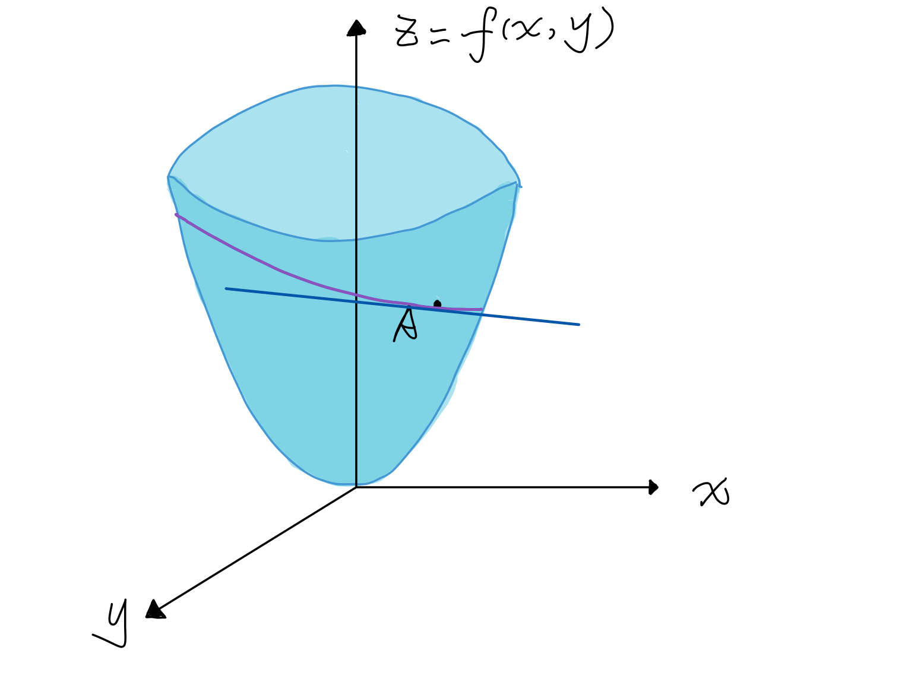
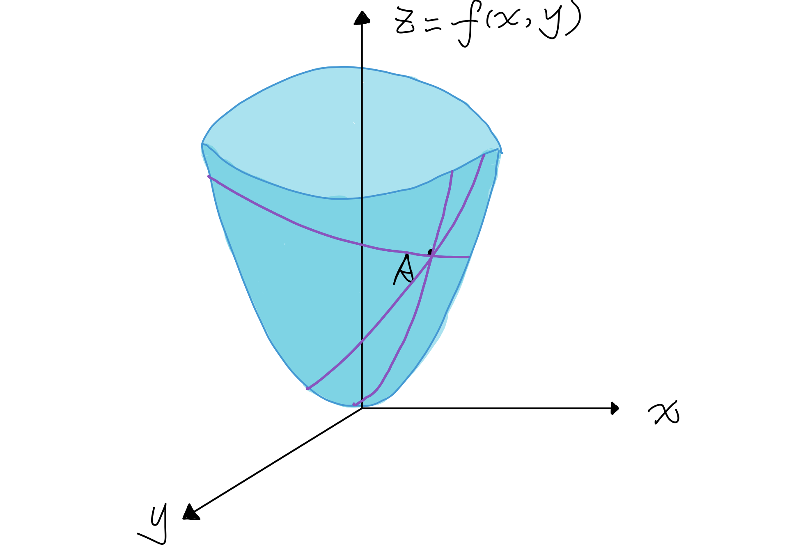
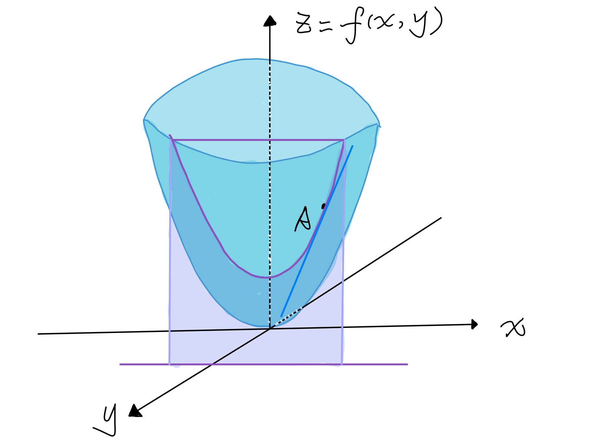
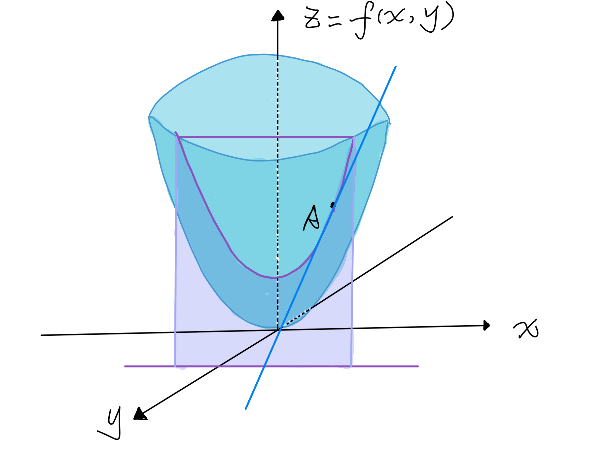

# 导数、方向导数和梯度

## 导数、方向导数和梯度

@\(Machine Learning\)

### 一元函数的导数

一元函数的情况下，导数就是函数的变化率： $$f'(x)=\frac{df}{dx}$$ 如果我们在图上作出该一元函数的图像，那么函数$f\(x\)$在该点的导数就是在该点切线的斜率。  图中蓝色切线的斜率即为函数$$f(x)$$在$$A$$点的导数。

### 多元函数的全导数

全导数非常简单，其实**全导数本质上就是一元函数的导数**。他是针对复合函数而言的定义。比如$$\begin{cases}z=f(x,y)\\x=u(t)\\y=v(t) \end{cases}$$。那么$$z$$关于$$t$$的导数就是全导数。所以我说本质上就是个一元函数的导数，$$z$$本质上就是个关于$$t$$的一元函数。因此全导数没什么难于理解的，只不过为了复数函数的求导而被定义了出来。对于**真正的多元函数是没有全导数这一说的，只有偏导数、偏微分和全微分。** 假设我们有一个二元函数$$f(x,y)=x^2+y^2$$, 过曲面上的一点$$A$$可以画无数道在曲面上的曲线: 每根曲线都**可能**过$$A$$点作出一条切线：  每一条切线都和一个全导数“相关”，$$A$$点有无数个全导数。

#### 偏导数

**偏导数是特殊的全导数**。 假设我们过$$A$$点作一条平行于$$x$$轴的直线，那么这个直线的方程为$$y=y_A$$,这条直线与$$z$$轴形成一个平面，这个平面与函数$$f(x,y)$$相交得到一条曲线，这条曲线的参数方程为$$\begin{cases}z=x^2+y^2\\x=t\\y=y_A\end{cases}$$。此时函数$$f(x,y)$$的偏导数$$\frac{\partial f(x,y)}{\partial x}$$就是该曲线经过$$A$$点的切线的斜率。  也就是说**偏导数是特定曲线（由平行于某个轴的直线决定的）所确定的全导数**。

#### 方向导数

**方向导数是特殊的全导数**。 同样的，在$$xy$$平面上，我们可以用射线决定曲线。同样的，我们假设有一条射线为$$(cos\alpha, sin\alpha)$$, 那么它所确定的曲线的参数方程为$$\begin{cases}z=x^2+y^2\\x=x_A+tcos\alpha & t\ge0\\y=y_A+tsin\alpha & t\ge0\end{cases}$$ 当我们将该曲线映射到$$zt$$平面上的时候，曲线也不会变形。 因此这条曲线的切线的斜率就是$$A$$点在射线方向上的方向导数。 

**方向导数的计算**

我们可以通过偏微分得到任何方向的导数。 假设我们有一个单位向量$$u=icos\alpha +jsin\alpha$$，那么沿着该方向的方向导数的定义为 $$\begin{split} D_uf &= \lim_{t \to 0}\frac{f(x_0+tcos\alpha, y_0+tsin\alpha)-f(x_0,y_0)}{t} \\ &= \lim_{t \to 0}\frac{f(x_0+tcos\alpha, y_0+tsin\alpha)-f(x_0, y_0+tsin\alpha)+f(x_0, y_0+tsin\alpha)-f(x_0,y_0)}{t} \\ &=f_x(x,y)cos\alpha+f_y(x,y)sin\alpha \end{split}$$

利用偏微分我们可以得到方向导数为$$D_uf=f_x(x,y)cos\alpha+f_y(x,y)sin\alpha$$

#### 全导数

在偏导数和方向导数的例子里， 我们得到的曲线是在一个平行于$$xy$$平面的平面上的，也就是说即使我们将该曲线映射到$$zt$$平面，该曲线也依然不会变形，因此， 曲线的切线与$$xyz$$空间中的切线是一致的，所以对于偏导数和方向导数，我们可以用曲线切线的斜率来代替全导数。 在$$xy$$平面上除了平行于$$x,y$$轴的直线，和射线外。还有其他的曲线，他们也能决定$$z=f(x,y)$$曲面上的曲线。曲线的参数方程为 $$\begin{cases} z=f(x,y)\\ x = x(t)\\ y=y(t) \end{cases}$$ 由于该曲线上的点不一定在同一平面上，因此我们无法将它映射到一个平面上。 一般来说（除了偏导、方向导数，下面说的全导全部指除了偏导和方向导数之外的），**全导数不是这根曲线的切线的斜率**。

#### 多元函数的梯度

**梯度：是一个矢量，其方向上的方向导数最大，其大小正好是此最大方向导数。** 对于某个多元函数上的某个点，我们可以沿着不同的方向得到它的方向导数，这样的方向导数有无数个。

梯度的数学定义为：设函数$$f(x,y)$$在平面区域$$D$$内具有一阶连续偏导数，则对每一点$$P(x_0,y_0)\in D$$，都可以定义出一个向量$$f_x(x_0,y_0)i+f_y(x_0,y_0)j$$ 称为 $$f(x,y)$$ 在$$P$$点出的梯度，记作$$\nabla f(x_0,y_0)$$。 具有一阶连续偏导数，意味着可微。可微意味着函数**f\(x,y\)在各个方向的切线都在同一个平面上**，也就是切平面。 所有的切线都在一个平面上，每条曲线都与这个切平面相切，某一点一定有且只有一个（梯度为0的情况除外）最陡峭的地方（因为方向导数是切线的斜率，方向导数最大也就意味着最陡峭）。

**梯度的计算**

任意方向导数的大小为$$D_uf=f_x(x,y)cos\alpha+f_y(x,y)sin\alpha$$。当方向导数的方向在$$(f_x(x,y), f_y(x,y))$$的时候，$$D_uf$$能取到最大值，其最大值为向量$$f_x(x,y), f_y(x,y)$$的长度。

## 参考资料

1. [什么是全导数-知乎](https://www.zhihu.com/question/26966355/answer/154857139)

